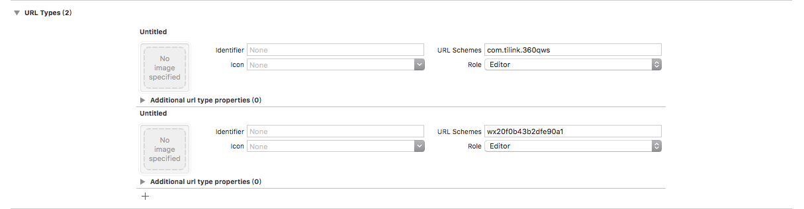

# OKPaypp 使用文档

OKPaypp 继承了支付宝，微信以及银联等便捷支付方式，在使用前需要准备好相关支付账号，注册相应平台应用，并获得支付能力。

## 使用

1. 导入此库,并请将 weixin 、 alipay 字段添加到 info.plist 白名单
2. 并添加两个 URL Schemes 如图:



## 示例

### 配置

```objc
- (BOOL)application:(UIApplication *)application didFinishLaunchingWithOptions:(NSDictionary *)launchOptions
{
    // Override point for customization after application launch.
    OKPayDefaultConfigurator *config = [[OKPayDefaultConfigurator alloc] init];
    config.appScheme = @"com.tilink.360qws";
    config.wxPayAppId = @"wx20f0b43b2dfe90a1";
    config.WXAppdesc = @"lignwuapp";
    config.tnmode = @"01";
    
    [OKPaypp setPayPayDefaultConfigurator:config];
    return YES;
}
```

### 创建支付

```objc
/**
支付调用接口

@param charge Charge 对象(JSON 格式字符串 或 NSDictionary)
@param channel 支付渠道
@param viewController 银联渠道需要
@param scheme URL Scheme，支付宝渠道需要
@param completionBlock 支付结果回调
*/
+ (void)createPayment:(NSObject *)charge channel:(OKPayChannle)channel viewController:(UIViewController *)viewController appURLScheme:(NSString *)scheme withCompletion:(OKPayppCompletion)completionBlock;
```

### 处理支付结果

```objc
#if __IPHONE_OS_VERSION_MAX_ALLOWED >= __IPHONE_9_0
- (BOOL)application:(UIApplication *)app openURL:(NSURL *)url options:(NSDictionary<UIApplicationOpenURLOptionsKey,id> *)options {
    return [OKPaypp handleOpenURL:url withCompletion:^(NSString *result, OKPayppError *error) {
        NSLog(@"%@", result);
    }];
}
#endif

- (BOOL)application:(UIApplication *)application handleOpenURL:(NSURL *)url {
    return [OKPaypp handleOpenURL:url withCompletion:^(NSString *result, OKPayppError *error) {
        NSLog(@"%@", result);
    }];
}

- (BOOL)application:(UIApplication *)app openURL:(NSURL *)url sourceApplication:(nullable NSString *)sourceApplication annotation:(nonnull id)annotation {
    return [OKPaypp handleOpenURL:url sourceApplication:sourceApplication withCompletion:^(NSString *result, OKPayppError *error) {
        NSLog(@"%@", result);
    }];
}
```

## 模块化

在该项目中，我为每一个渠道都添加了一个公开文件，并遵守相关协议，减小平台间的差异化，在外部可以做到无差别调用。

```shell
├── Channels
│   ├── Alipay
│   │   ├── AlipaySDK.bundle
│   │   │   ├── bar@2x.png
│   │   │   ├── refresh@2x.png
│   │   │   ├── refresh_click@2x.png
│   │   │   ├── shutdown@2x.png
│   │   │   └── shutdown_click@2x.png
│   │   ├── AlipaySDK.framework
│   │   │   ├── AlipaySDK
│   │   │   ├── Headers
│   │   │   │   ├── APayAuthInfo.h
│   │   │   │   └── AlipaySDK.h
│   │   │   ├── Info.plist
│   │   │   └── en.lproj
│   │   │       └── InfoPlist.strings
│   │   ├── OKPaymentAlipay.h
│   │   └── OKPaymentAlipay.m
│   ├── UnionPay
│   │   ├── OKPaymentUnionPay.h
│   │   ├── OKPaymentUnionPay.mm
│   │   ├── UPPaymentControl.h
│   │   └── libPaymentControl.a
│   └── Wx
│       ├── OKPaymentWx.h
│       ├── OKPaymentWx.m
│       ├── README.txt
│       ├── WXApi.h
│       ├── WXApiObject.h
│       ├── WechatAuthSDK.h
│       └── libWeChatSDK.a
├── Core
│   ├── OKPayDefaultConfigurator.h
│   ├── OKPayDefaultConfigurator.m
│   ├── OKPayment.h
│   └── OKPayment.m
├── OKPaypp.h
└── OKPaypp.m
```

## 附录

### 微信

```
//以下状态码含义与官方SDK一致
errCode = 0,成功<br>
errCode = -1,普通错误类型<br>
errCode = -2,用户点击取消并返回<br>
errCode = -3,发送失败<br>
errCode = -4,授权失败 <br>
errCode = -5,微信不支持<br>
```

### 支付宝

```
{
    "result":"",
    "resultStatus":"9000",
    "memo":"支付成功"
}

//以下状态码含义与官方SDK一致
resultStatus = 9000,支付成功<br>
resultStatus = 8000,正在处理中，支付结果未知（有可能已经支付成功）,请查询商户订单列表中订单的支付状态<br>
resultStatus = 4000,支付失败<br>
resultStatus = 5000,重复请求<br>
resultStatus = 6001,用户中途取消<br>
resultStatus = 6002,网络连接出错<br>
resultStatus = 6004,支付结果未知（有可能已经支付成功），请查询商户订单列表中订单的支付状态<br>
```

### 银联

```
{
  "code":"00",
  "data":{}
}

code = "success", 支付成功
code = "fail", 支付失败
code = "cancel", 支付取消
```